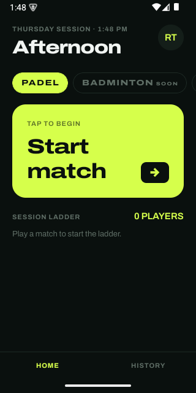
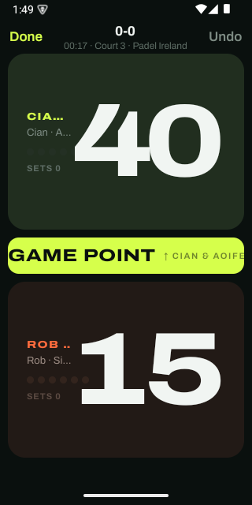

# RacketTrack

A padel score tracker for casual friend-group sessions, built for Android with Expo and Supabase.
One phone acts as the scoreboard: two large tap zones, one per team, real padel rules underneath
(15/30/40, deuce, golden point, tiebreak), and a "hype ticker" that lights up at match-defining
moments. There are also placeholders for future racket sport rule-sets to be added such as badminton, tennis, etc.

<p align="center">
  
  &nbsp;&nbsp;
  
</p>

## Why this project exists

My friends and I had a common problem when playing padel together, which was we always forgot to keep track of the scores in the match. I then thought that I could make a simple yet intuitive Android app that could keep track of the score for us. I wanted to actually use something I built, not just add another CRUD app to a portfolio - and I
wanted to get genuinely good at working with AI coding tools while doing it, not just prompt-and-paste.
So the real brief here was two projects at once: a padel app for my own friend group, and a deliberate
exercise in **spec-driven, AI-assisted development** , writing a detailed engineering handoff up
front (see [`docs/design-handoff/`](docs/design-handoff/)), then working with
Claude Code through the actual build: reviewing every architectural
decision, testing on a real Android emulator rather than trusting green tests, and tracking down bugs
that only showed up once the app was actually running.

[`CLAUDE.md`](CLAUDE.md) is the standing instructions the agent worked from throughout, and
[`HANDOFF.md`](HANDOFF.md) is a session-by-session log of what got built, what broke, and reasonings to both. This was
kept as a real record of the process rather than cleaned away. If you're evaluating how I work with
these tools rather than just what the app does, that's the place to look.

## Status: work in progress

Built and running on a local Android emulator, not yet shipped anywhere.

| Phase | State |
|---|---|
| Scoring engine (padel rules, pure & fully tested) |  Done |
| Live scoreboard, hype ticker, haptics, undo |  Done |
| Local match history, session ladder, recap |  Done |
| Auth (Google + magic link), squads, roster sync |  Built, sign-in not yet completed on a real account |
| Push notifications, accessibility pass, release build |  Not started |

44 automated tests passing, `tsc --noEmit` clean. Full detail on what's verified versus what's still
blocked is in [`HANDOFF.md`](HANDOFF.md).

## What it does

- Real padel scoring: 15/30/40, deuce, golden point (toggleable), sets, tiebreak: as a pure,
  100%-branch-tested rules engine, not UI-driven state.
- A live scoreboard built for a court, not a phone in your hand: two giant tap zones, haptic feedback
  scaled to what the point was worth, and a status ticker that calls out game/set/match point.
- Fully offline-first: score a whole match in airplane mode. Matches sync to a squad automatically
  once you're signed in and one exists; guest mode works with no account at all.
- Squads with shareable invite codes, a shared roster, and a session ladder ranked by wins.

## How it's built

**Client:** React Native (Expo SDK 57, managed workflow + dev client), TypeScript strict, Expo Router,
Zustand + MMKV for local state, TanStack Query for server state, Reanimated 3 for motion.
**Backend:** Supabase, Postgres, Auth, Row-Level Security as the entire authorization layer, one
Postgres function that lands a whole match atomically.

The one architectural decision everything else follows from: **a match is a list of point winners,
not a mutable score.** `timeline: TeamIndex[]` is the only durable data; score, games, sets, and who's
serving are all *derived* by replaying that list through a pure function
(`src/features/scoring/engine.ts`). That single choice is what makes undo trivial, sync idempotent,
and the whole engine testable without rendering anything.

## Project structure

```
app/                  Expo Router routes — screens only, no business logic
src/features/         scoring engine, live match store, auth, squads — by domain
src/components/       shared UI (tap zones, ticker, buttons, list rows)
src/lib/              storage, Supabase client, offline outbox, local archive
src/theme/            design tokens — every colour, size, and motion timing
supabase/migrations/  the full Postgres schema, RLS policies, and RPCs
docs/design-handoff/  the original engineering spec this was built from
```

## Running it

```bash
npm install
cp .env.example .env        # fill in a Supabase project URL/anon key to enable auth+sync (optional)
npx expo run:android         # compiles locally, installs on a connected device or emulator
```

Expo Go will **not** work — this app uses native modules (MMKV, Google Sign-In) that require a dev
client build. `docs/design-handoff/00-START-HERE.md` has full environment setup if you're starting
from scratch.

```bash
npm test              # 44 tests — the scoring engine's full rules matrix & a property test
npm run typecheck      # tsc --noEmit
```

## What's next

Getting a real account signed in end-to-end (Google Sign-In reaches the real picker; email magic
link works but hit Gmail's link-prescanning in testing), then phase 5 (surfacing synced squad-mates'
matches in history) and phase 6 (push notifications, a real app icon and branding, release signing). See
[`HANDOFF.md`](HANDOFF.md) for the detailed next-steps list.

## License

MIT — see [`LICENSE`](LICENSE).
